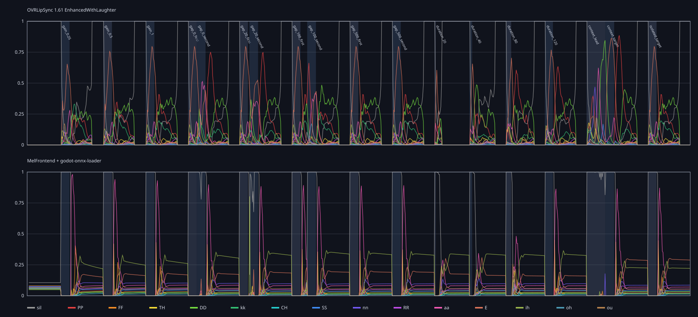

# Experiment 001: Temporal memory in repeated speech

## Hypothesis

OVRLipSync's stable and lively animation may come from more than independent
classification of each short audio frame. Repeating identical PCM after
different silence gaps should reveal persistent state or smoothing. Scaling the
same PCM should reveal whether level controls articulation strength.

## Method

The 130 ms `/AE/` interval from LibriSpeech stem `1320-122617-0010`
(`0.81–0.94 s`) was copied exactly and arranged into an artificial 16 kHz mono
probe by `tests/build_ovr_temporal_probe.py`:

- fixed gains `0.25`, `0.5`, and `1.0`;
- identical pairs separated by `0`, `20`, `100`, and `500 ms`;
- centred excerpts of `20`, `40`, `80`, and `120 ms`;
- the target after its natural lead-in and after silence.

OVRLipSync 1.61 EnhancedWithLaughter used one persistent context, its default
smoothing, and 10 ms calls at real cadence. The matching MEL/ONNX stream used
the `full-test-clean-d21-hard-l10` model and its live causal frontend.

## Findings

- OVR identified the isolated target primarily as `E`.
- Mean `E` weight increased from `0.402` at 0.25 gain to `0.478` at 0.5 and
  `0.506` at 1.0. Peak weights were `0.655`, `0.756`, and `0.798`.
- OVR took about 35 ms from sound onset before `E` became dominant.
- Twenty milliseconds was insufficient, 40 ms remained ambiguous, and `E`
  became dominant at about 80 ms.
- Identical repeats produced materially different traces after gaps of
  0–100 ms. After 500 ms the two traces were sample-for-sample identical.
- Following the 130 ms excerpt, OVR continued emitting changing non-silence
  classes for about 305 ms.
- Natural preceding context raised mean `E` from `0.506` to `0.677` and carried
  some preceding `DD` into the target.
- The MEL/ONNX live path handled this silence-heavy artificial sequence badly:
  target activity was delayed and long silences were frequently labelled `ih`.
  This diagnoses the streaming frontend/model contract, not held-out model
  accuracy.

These results support persistent temporal processing in OVR. They do not yet
separate SDK smoothing from state inside its classifier.

Private data includes the generated WAV, event manifest and both full traces.

