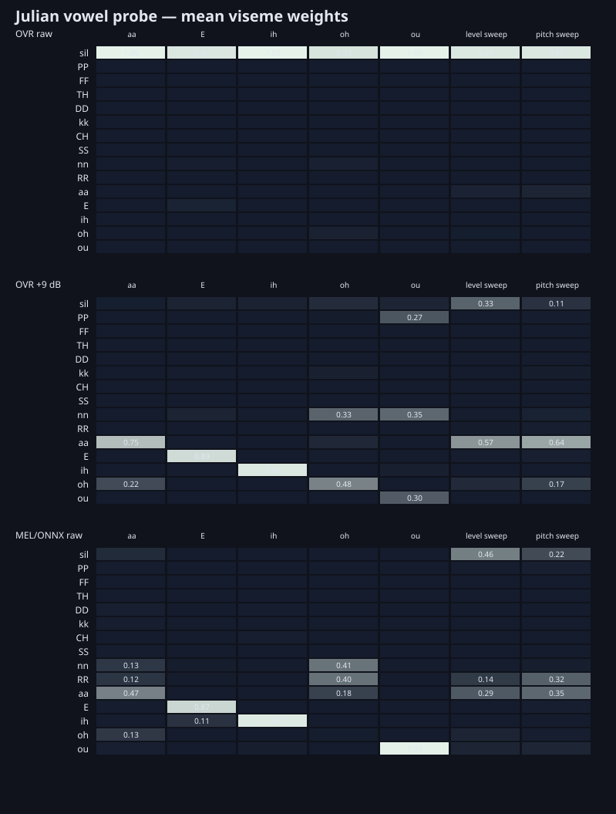

# Experiment 002: Recorded sustained vowels, level and pitch

## Hypothesis

A natural voice recording can show whether OVR's attractive within-vowel motion
tracks acoustic variation, absolute level, pitch, or temporal filtering. It can
also reveal whether the MEL/ONNX instability seen on a microphone is present on
controlled sustained vowels.

## Recording and method

The participant recorded 81.107 seconds in Audacity as unprocessed 48 kHz,
16-bit mono PCM. The recording contained sustained `aa`, `E`, `ih`, `oh`, and
`ou`, an `aa` level sweep, an `aa` pitch sweep, transitions, short syllables,
and room silence.

- No samples clipped; peak was `-10.45 dBFS`.
- The first second of room tone measured about `-67.48 dBFS` RMS.
- The original was resampled to 16 kHz with SoX's very-high-quality rate
  converter.
- OVR was measured once at untouched level and once at a fixed `+9 dB`; the
  latter still had a maximum amplitude of only `0.844` and did not clip.
- The MEL/ONNX path used the untouched 16 kHz signal.
- Times below are energy-derived approximate interval boundaries, not MFA.

## Findings

At the untouched recording level, OVR treated nearly all five sustained vowels
as silence. The fixed +9 dB pass changed that sharply:

| Spoken interval | OVR +9 dB mean leaders | MEL/ONNX raw mean leaders |
|---|---|---|
| `aa` | `aa 0.75`, `oh 0.22` | `aa 0.47`, `oh 0.13`, `nn 0.13` |
| `E` | `E 0.89` | `E 0.87`, `ih 0.11` |
| `ih` | `ih 0.95` | `ih 0.96` |
| `oh` | `oh 0.48`, `nn 0.33` | `nn 0.41`, `RR 0.40` |
| `ou` | `nn 0.35`, `ou 0.30`, `PP 0.27` | `ou 0.99` |

OVR held `E` and `ih` with only one dominant-class change across each
multi-second interval. ONNX recognized them but changed dominant class 17 and
8 times respectively. During the pitch sweep OVR changed dominant class 21
times versus 97 for ONNX.

The live application's gain/AGC is therefore an essential part of the good OVR
result. OVR's pleasing animation does not imply that every dominant phonetic
label is correct: `ou` was especially questionable. This supports the idea of
a noisy classifier combined with useful artistic temporal shaping.

Private data contains the identifiable source recording, derived WAVs and
full-resolution traces. It is intentionally excluded from Git.

