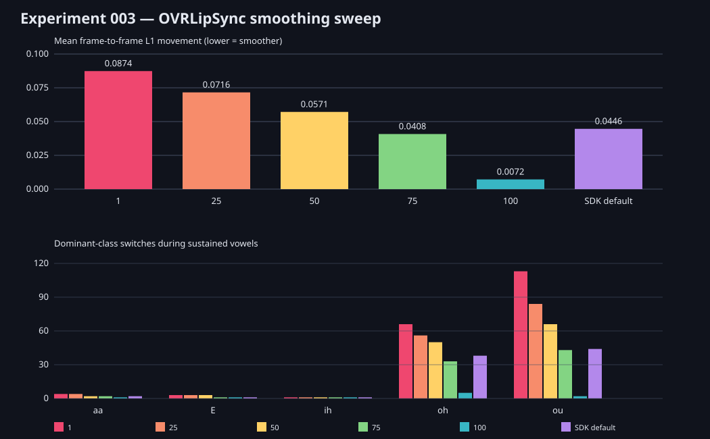

# Experiment 003: OVRLipSync smoothing sweep

## Hypothesis

The subtle movement and stability of OVRLipSync may be produced by its exposed
`VisemeSmoothing` signal. Sweeping the SDK's accepted range using identical PCM
should reveal which variations originate before and after that filter.

## Planned controlled variables

- OVRLipSync 1.61, EnhancedWithLaughter provider.
- Identical 16 kHz mono recording with fixed +9 dB gain and no clipping.
- One fresh context per run.
- Smoothing values `1`, `25`, `50`, `75`, and `100`, plus the SDK default.
- Ten-millisecond input frames.
- Compare transition rate, frame-to-frame movement, dominant-class dwell,
  onset/offset response and sustained-vowel variance.

The SDK call is `SendSignal(context, VisemeSmoothing, amount, 0)`. Historical
Unity integration validates the practical range as 1–100 even though one native
header comment says 0–100. Results will establish the direction empirically.

## Findings

The direction was established empirically: larger values produce more
smoothing, not a larger step toward the current target.

| Smoothing | Whole-trace mean frame L1 movement | `oh` switches | `ou` switches | Pitch-sweep switches |
|---:|---:|---:|---:|---:|
| 1 | 0.0874 | 66 | 113 | 47 |
| 25 | 0.0716 | 56 | 84 | 37 |
| 50 | 0.0571 | 50 | 66 | 29 |
| 75 | 0.0408 | 33 | 43 | 19 |
| 100 | 0.0072 | 5 | 2 | 3 |
| SDK default | 0.0446 | 38 | 44 | 21 |

Smoothing 75 was closest to the default over the complete 81-second trace
(weight RMSE `0.00973`). It is not identical, so this does not prove that the
default is exactly 75; interpolation and/or a nearby internal default remain
possible.

At 100 the output nearly freezes each established pose. At 1 the underlying
classifier is much more visible and substantially more volatile, particularly
for `oh` and `ou`. The pleasing default behavior therefore includes major SDK
post-classifier temporal shaping. The filtering does not explain everything:
even at strong smoothing the selected pose and its slow variation remain driven
by the acoustic classifier and input level.

Changing smoothing had no material cost. Values 25–75 averaged approximately
`0.119 ms` per unpaced 10 ms call on the Windows test machine. These timings
describe synchronous SDK calls in a hot sequential run, not total application
CPU or scheduled real-time cost.

The ignored private directory contains all six full 8,110-frame traces and the
exact fixed-gain WAV used for the sweep.
