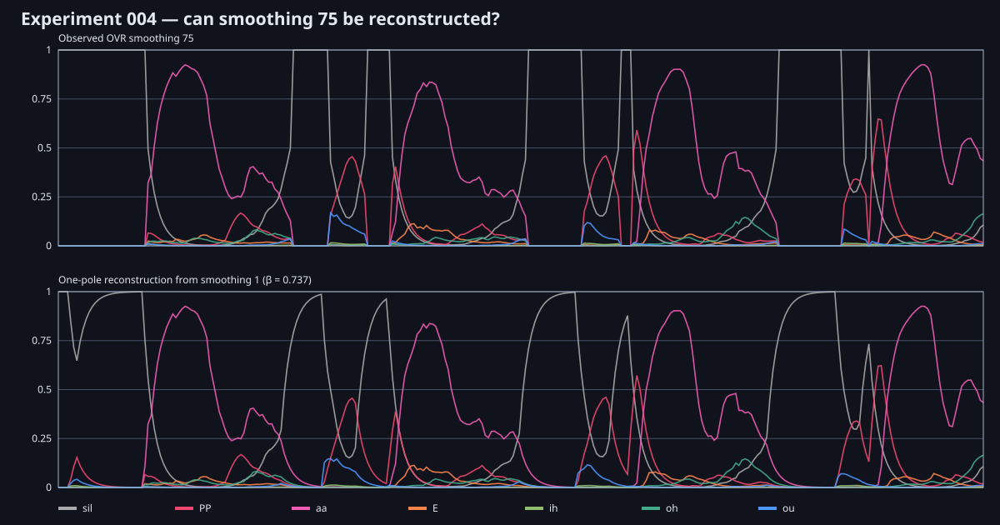

# Experiment 004: Can OVR smoothing be reproduced externally?

## Hypothesis

If OVR's smoothing is a simple operation after classification, traces at higher
smoothing settings should be recoverable by causally filtering the least
smoothed trace. If changing the setting substantially changes deeper classifier
decisions, a simple filter should fail even on identical input.

## Method

The smoothing-1 trace was treated as the closest available observation of the
unfiltered output. A putative raw target was recovered assuming smoothing 1
retains 1% of the preceding value. A one-pole causal filter

`output[t] = beta * output[t-1] + (1-beta) * target[t]`

was fitted separately to the observed smoothing 25, 50, 75 and 100 traces. All
runs used identical PCM and a fresh OVR context. This tests output equivalence;
it cannot reveal proprietary internal implementation.

## Findings

| OVR setting | Best fitted `beta` | Filtered RMSE | Unfiltered RMSE |
|---:|---:|---:|---:|
| 25 | 0.2567 | 0.00759 | 0.01147 |
| 50 | 0.4852 | 0.00914 | 0.02075 |
| 75 | 0.7370 | 0.01307 | 0.03912 |
| 100 | 0.9873 | 0.03974 | 0.12929 |

The fitted weights for 25–75 are close to the setting divided by 100. The
filter removes about two-thirds of the smoothing-75 error relative to using the
smoothing-1 trace unchanged. This is strong evidence for a post-classifier
temporal operation.

All 15 reported weights sum to one to floating-point precision at every tested
setting. `sil` is therefore not an independent aperture value: increasing it
necessarily decreases the combined non-silence weight. Its best fitted
smoothing-75 coefficient was `0.7328`, close to the shared `0.7370` fit. Its
absolute residual was larger because `sil` spans almost the entire 0–1 range;
this test provides no strong evidence that it uses a different time constant.

It is not exact. Residual error rises during rapidly changing speech, and
smoothing 100 is especially poorly represented by a one-pole filter. Plausible
explanations include nonlinear limiting, multiple filter stages, class-dependent
behavior, or smoothing state coupled more deeply into the closed classifier.
The public API does not let us distinguish those mechanisms.

The first panel below is smoothing 1, the least-smoothed output the SDK exposes;
it must not be interpreted as a guaranteed raw internal classifier output.

For our own system, an inexpensive causal smoother can reproduce the principal
artistic effect. We should measure its perceptual quality rather than attempting
to clone every residual difference.
