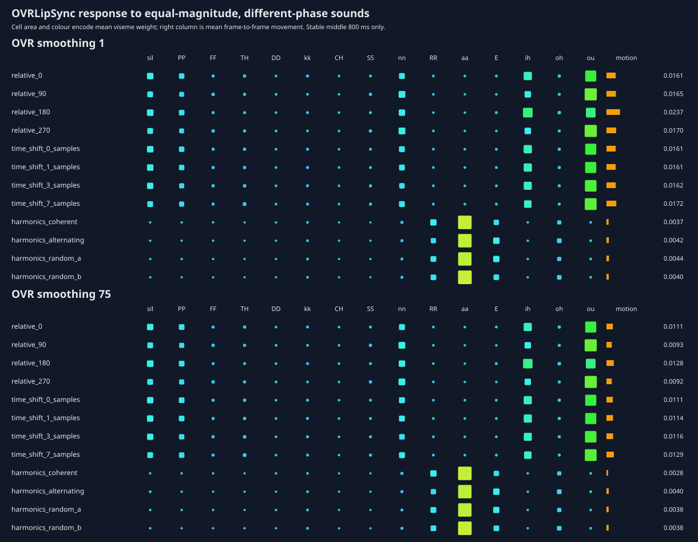

# Experiment 006: Does OVRLipSync retain phase information?

## Hypothesis

A magnitude-only FFT or MEL frontend cannot distinguish stationary signals that
have identical frequency magnitudes but different phase. If OVRLipSync changes
its stable output between those signals, its frontend retains waveform or phase
information discarded by our log-MEL input.

## Method

`tests/build_ovr_phase_probe.py` generated twelve 1.2-second, 16 kHz signals.
Every edge has an exactly-zero 5 ms raised-cosine taper. The measurement excludes
200 ms at both ends, so neither the taper nor onset/offset state is included.

- Four equal-amplitude 200 + 400 Hz tones vary only the second tone's relative
  phase by 90 degrees. Both frequencies land exactly on FFT bins for 10 ms and
  25 ms windows.
- Four copies of one two-tone waveform are shifted by 0, 1, 3 and 7 samples.
- Four vowel-like harmonic stacks share identical harmonic magnitudes and use
  coherent, alternating or two deterministic random phase patterns.

OVRLipSync 1.61 EnhancedWithLaughter processed fresh copies of the same WAV at
10 ms per call with SDK smoothing 1 and 75.

## Findings

OVR is measurably phase-sensitive. At smoothing 1, changing only relative phase
gave a maximum pairwise output RMSE of `0.0906`; shifting the same waveform by
0–7 samples gave `0.0270`; and changing phase across the harmonic vowel stack
gave `0.0172`. Smoothing 75 barely changed those mean differences (`0.0880`,
`0.0258`, and `0.0170` respectively), demonstrating that they originate before
the exposed animation smoother.

The largest two-tone change was linguistically arbitrary but substantial:
`relative_0` averaged `ou 0.492 / ih 0.228`, while `relative_180` averaged
`ou 0.347 / ih 0.339`. The harmonic stacks all remained strongly `aa`, so phase
altered their secondary mixture without destroying their shared vowel identity.

This proves that OVR retains information unavailable to magnitude MEL. It does
**not** prove that phase is responsible for OVR's advantage on real speech, nor
that adding phase will improve held-out viseme accuracy. The next controlled
comparison must add phase-aware features to our model while holding data,
receptive support and postprocessing constant.

The ignored `private` directory contains the playable WAV, manifest and complete
OVR traces. `results.json` contains the public numerical summary.
