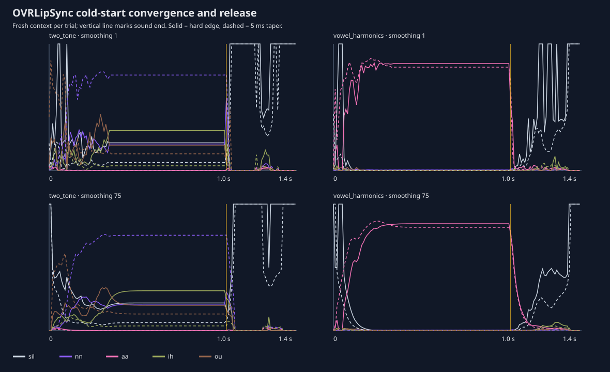

# Experiment 007: OVR acoustic support and cold-start state

## Question

Does OVR behave like an independent magnitude-MEL classifier with a short fixed
support, or does waveform phase, boundary shape and longer-lived state affect
each output? This black-box test cannot identify the proprietary classifier or
establish whether its architecture is computationally preferable.

## Method

`tests/build_ovr_support_probe.py` generated two stationary 16 kHz sources: a
200 + 400 Hz two-tone signal and a vowel-like harmonic stack. Durations were
10, 20, 30, 40, 60, 80, 120, 200, 400 and 1000 ms. Every condition was emitted
both with a hard boundary and with a 5 ms raised-cosine taper, at matched RMS.

The exporter recreated the OVR context 500 ms into each 700 ms silent gap, so
every condition began from identical cold state. OVRLipSync 1.61
EnhancedWithLaughter ran with 10 ms calls at smoothing 1 and 75. Reversing all
40 trials reproduced every smoothing-1 trace exactly, ruling out trial order.

## Findings

There is no single short rectangular support that explains the response.

- The vowel-like hard signal reached and remained within `0.02` RMSE of its
  stable mixture after about 180 ms at smoothing 1; the tapered case took about
  220 ms.
- Two-tone convergence took approximately 240–340 ms.
- Short hard boundaries generated strong transient `PP`, `DD` and silence
  responses. Tapered vowel probes produced recognisable `aa` much earlier,
  showing that boundary spectral splatter materially confounds short probes.
- After a one-second vowel ended, smoothing-1 closure took approximately
  160 ms with a hard edge and 330 ms with the taper. The exposed animation
  smoother is therefore not the only source of persistence.
- Most remarkably, hard and tapered versions of the continuing two-tone signal
  settled to different mixtures for the rest of the one-second trial. Their
  stable-vector RMSE was `0.164`, despite only a 0.3% middle-RMS difference.
  Reversing trial order reproduced both results exactly.

The last observation is compatible with recurrent classifier state or slow
adaptation seeded by the onset. It does not yet establish that the SDK estimates
speaker identity; possible state variables include level/noise normalization,
pitch, spectral tilt, vocal-tract characteristics, or an ordinary recurrent
network state.

Combined with Experiment 006, OVR cannot be reproduced by our magnitude MEL
values alone: it is phase-sensitive and history-sensitive. The Windows binary
also emits Caffe2 runtime diagnostics, which is direct evidence of a neural
runtime predating widespread ONNX Runtime use, though not disclosure of the
network architecture.

The ignored `private` directory contains the playable WAV, manifests and full
traces. `results.json` contains the public measurements.
