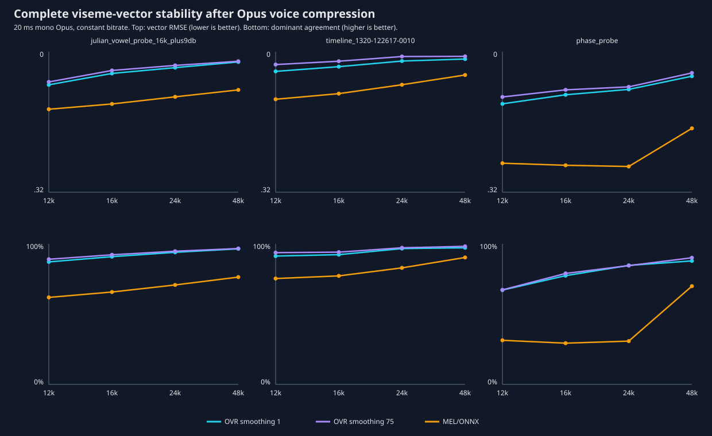

# Experiment 008: Viseme stability after Opus compression

## Question

Does Opus remove waveform information used by OVRLipSync, and is our
magnitude-MEL/ONNX path more invariant to compression? This experiment compares
the complete 15-value output vectors. It does not select two visemes, quantize
them, or test a rider transport.

## Method

Three mono 16 kHz sources were encoded with FFmpeg 8.0/libopus in `voip` mode,
20 ms frames, constant bitrate, at 12, 16, 24 and 48 kbit/s, then decoded to
16-bit 16 kHz PCM. Ogg Opus pre-skip produced equal sample counts; measured
residual alignment was 0–2 samples.

- Julian's fixed-gain vowel, pitch and speech recording;
- LibriSpeech comparison stem `1320-122617-0010`;
- the equal-magnitude/different-phase synthetic probe from Experiment 006.

Every original and decoded file was processed independently by OVRLipSync 1.61
EnhancedWithLaughter at smoothing 1 and 75, and by the unchanged live-causal
80-MEL/ONNX model. Metrics compare each decoded output with that classifier's
own original-PCM output; they measure codec stability, not phonetic accuracy.

## Findings

OVR was robust on real speech and consistently more stable than our current
MEL/ONNX stream. At 24 kbit/s:

| Source | System | Vector RMSE | Dominant agreement |
|---|---|---:|---:|
| Julian recording | OVR smoothing 1 | 0.036 | 93.9% |
| Julian recording | OVR smoothing 75 | 0.031 | 94.7% |
| Julian recording | MEL/ONNX | 0.103 | 70.8% |
| LibriSpeech stem | OVR smoothing 1 | 0.021 | 96.6% |
| LibriSpeech stem | OVR smoothing 75 | 0.011 | 97.2% |
| LibriSpeech stem | MEL/ONNX | 0.075 | 82.9% |

At 48 kbit/s OVR dominant agreement reached 96.4–98.2% on real speech. Even at
12 kbit/s it retained 87.2–93.7%. Smoothing 75 generally improved stability but
did not create it; the underlying OVR output was already robust.

The artificial phase probe was deliberately harsher. OVR smoothing-1 dominant
agreement rose from 67.1% at 12 kbit/s to 87.8% at 48 kbit/s, confirming that
Opus can disturb phase-sensitive decisions. The MEL/ONNX result was still less
stable (31.4% at 12 kbit/s and 69.9% at 48 kbit/s). Magnitude MEL therefore did
not confer codec invariance in this implementation. Its causal normalization,
training distribution and jittery classifier output are plausible contributors.

These are 16 kHz classifier-input tests. Opus internally operates at its own
supported rates, but this does not yet test a 48 kHz microphone capture retaining
energy above 8 kHz, packet loss concealment, or the complete TwoVoIP chain.

The ignored `private` directory contains every Opus stream, decoded WAV, codec
manifest and full trace. `tests/build_opus_comparison.py`,
`tests/export_onnx_codec_batch.gd` and `tests/analyze_opus_robustness.py` reproduce
the experiment.
