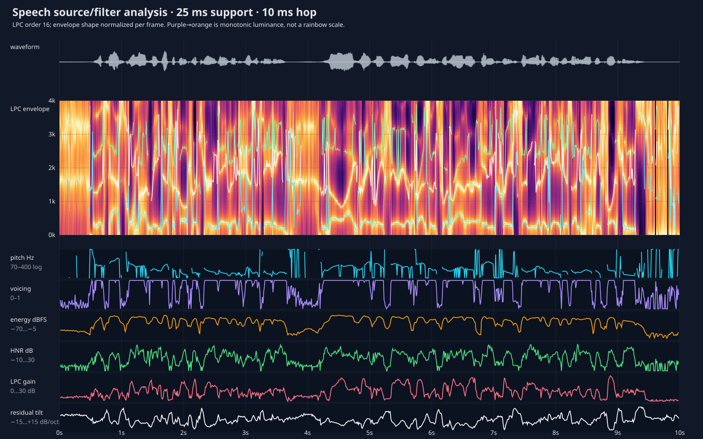

# 009 — Speech source/filter feature view

## Question

What established speech features can we inspect alongside the waveform instead
of treating an 80-band Mel spectrogram as the only representation of speech?

## Method

The source is the 16 kHz LibriSpeech stem `1320-122617-0010`, already used by
the Vizemes test harness. The analysis uses the same timing contract as that
harness: a 25 ms Hann-windowed support sampled every 10 ms.

Each frame contains an order-16 linear-predictive (LPC) source/filter analysis,
normalized autocorrelation pitch evidence, voicing confidence, harmonic to
noise ratio, RMS level, LPC prediction gain, and residual spectral tilt. The
bright curves over the LPC envelope are LPC peak candidates, not authoritative
formant measurements.



## Display choices

- Time is shared by every lane; frame values are placed at the centre of their
  25 ms support.
- The LPC envelope uses a linear 0–4 kHz vertical scale, useful for inspecting
  vocal-tract resonances. Its colour scale is monotonic dark-purple to pale
  yellow, so brightness has an unambiguous ordering.
- Envelope magnitude is normalized per frame. The separate fixed-scale energy
  lane preserves loudness, rather than allowing colour normalization to hide
  it.
- Fundamental frequency uses a logarithmic 70–400 Hz scale and has gaps when
  no voiced pitch is accepted. Voicing remains a distinct fixed 0–1 measure.
- HNR and LPC prediction gain use fixed decibel scales. Residual tilt is shown
  symmetrically around zero because pre-emphasis deliberately removes much of
  the original spectral slope.

## Finding and next use

This view separates likely *source* evidence (pitch, voicing, periodicity and
level) from the slowly varying *filter* envelope associated with vocal-tract
shape. It is therefore a better diagnostic for our hypothesis than simply
adding more Mel bands. It does not yet show that these features outperform Mel
inputs in a classifier; the next controlled model comparison must establish
that.

For a live Godot implementation, follow the existing `mic_record` design:
upload compact float images and perform scrolling, palette mapping and overlays
in a canvas shader. Use one time×frequency texture for the LPC envelope and a
small time×feature texture for the scalar lanes. Analysis stays on the CPU;
plotting should not add per-pixel GDScript work.

The generated `features.json` deliberately omits the dense LPC envelope and is
small enough for numerical inspection. Recreate both files with:

```sh
python3 tests/visualize_voice_features.py \
  /path/to/mono-16k.wav \
  experiments/009-voice-features/voice_features.svg \
  experiments/009-voice-features/features.json
```
